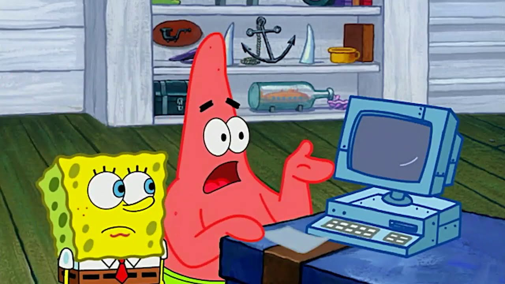

# Инструкция по основным возможностям MarkDown

## Выделение текста

Чтобы выделить текст курсивом - необходимо обрамить его звёздочками (\*) или знаком нижнего подчёркивания (\_). Например, *вот так* или _вот так_.

Чтобы выделить текст полужирным - необходимо обрамить его двойными звёздочками (\*\*) или двойным знаком нижнего подчёркивания (\_\_). Например, **вот так** или __вот так__.

Альтернативные способы выделения текста курсивом или полужирным нужны для того, чтобы мы могли совмещать оба этих способа. Например, _текст может быть выделен курсивом и при этом быть **полужирным**_.

## Списки
Чтобы добавить ненумерованный список - необходимо пункты выделить звёздочкой (\*) или знаком плюса (+). Например, вот так:
* первый элемент
* Б-этый элемент
* Г-этый элемент
* семидесятый элемент
* А-тый элемент
+ Плюсовый элемент
+ другой плюсовый элемент

Чтобы добавить нумерованный список - необходимо пункты просто пронумеровать. Например, вот так:
1. Первый пункт
2. Второй пункт

## Работа с изображениями

Чтобы вставить изображение в текст - достаточно написать следующее:

Примечание: пробелы и заэкранированные пробелы в названии или пути к файлу - не принимает.

Примеры:

## Ссылки

Чтобы вставить ссылку в текст - достаточно написать следующее:
[здесь то, что мы впервые читаем смотря на эту ссылку](здесь сама ссылка)

Пример:
Вот вам [мой репозиторий на GitHub](https://github.com/ivan-on-github3577).